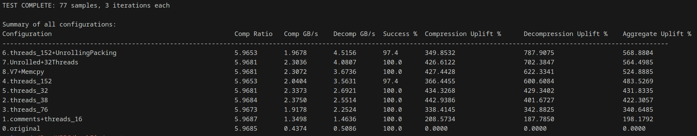
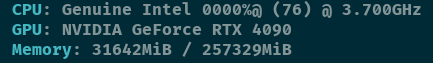

# HPPC CS:4700 Project
Project for CS:4700 High Performance Parallel Computing

# HPPC HawkZip Compression Project
Make sure you have downloaded the data set:
```
wget https://g-8d6b0.fd635.8443.data.globus.org/ds131.2/Data-Reduction-Repo/raw-data/CESM-ATM/SDRBENCH-CESM-ATM-1800x3600.tar.gz

# Extract all fields in this dataset (79 fields in total)
tar -xvf SDRBENCH-CESM-ATM-1800x3600.tar.gz
```

How to run a test of all versions:

in ./hawkZip

```
python testAll.py --data-dir ./1800x3600 --count 77 --iterations 3 --error 1e-4 --code-base-dir ./code --output-csv results.csv
```


# Tested on This Machine:

- 38 Core Xeon Platinum 8368Q 2.6 GHz base clock, 3.7 GHz boost clock
- 1.25 MB L2 per core
- 57 MB L3
- 256 GB of 3200MHz DDR4 on 8 channels

# Summary of Code Iterations
0. code we received at the start of the project
1. code with added comments to get a better understanding of how it works, along with the change to 16 threads for NUM_THREADS;
2. NUM_THREADS set to 38
3. NUM_THREADS set to 76
4. NUM_THREADS set to 152
    - tends to fail error check more often
5. NUM_THREADS set to 32
6. NUM_THREADS set to 152, packing and unpacking of bytes done in for loops unrolled
7. NUM_Threads set to 32 + Unrolled loops 
8. NUM_Threads set to 32 + Unrolled loops, Using memcpy and char arrays to move chars in and out of unpacking, rather than 4 seprate char variables
    - apparent performance decrease

